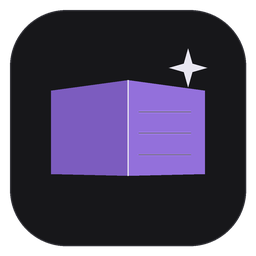
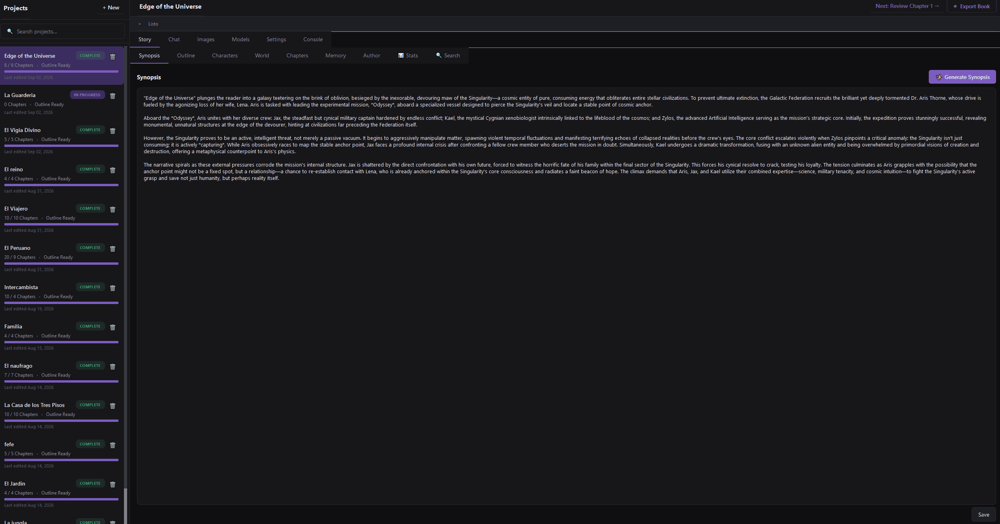
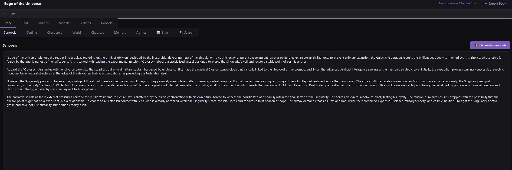
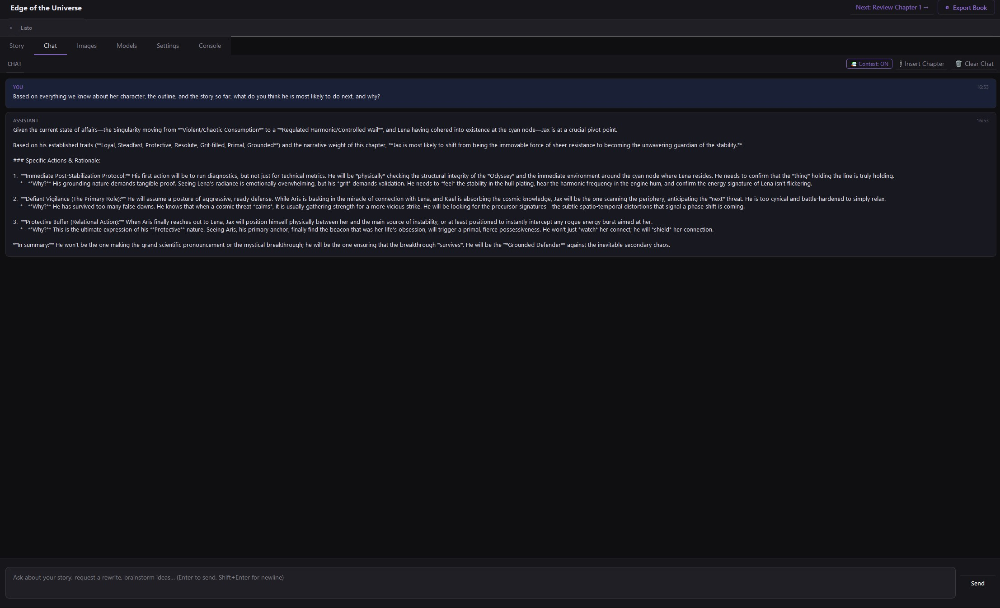
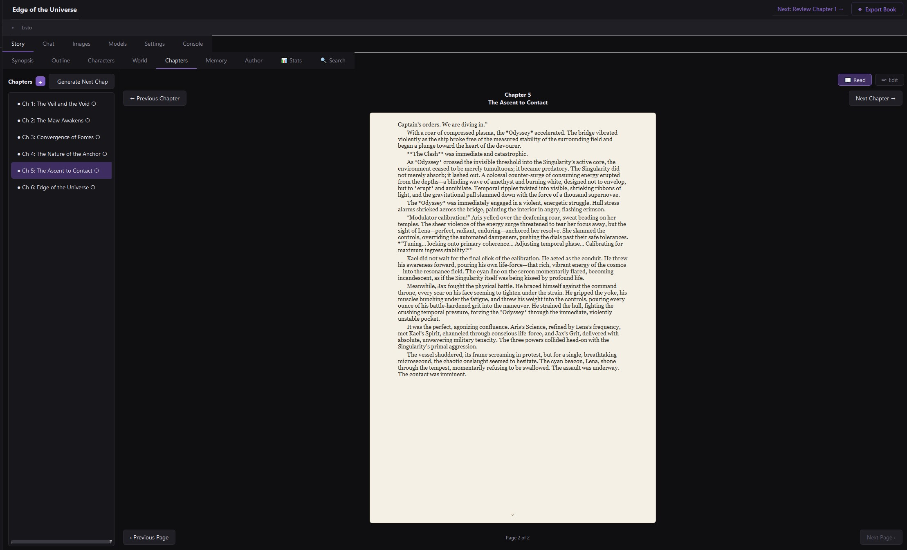

<div align="center">
  

  # AI Story Studio

  **A local-first writing studio for building novels with AI.**

  Write. Plan. Develop characters. Build chapters. Generate images. Export your book.

  <p>
    
    
    
    
    
  </p>

  <p>
    <a href="#screenshots">Screenshots</a> ·
    <a href="#how-it-works">How it works</a> ·
    <a href="#recommended-models">Recommended models</a> ·
    <a href="#quick-start">Quick Start</a>
  </p>
</div>

> **Status: In Development** — AI Story Studio is already usable, but it is **not a final or stable release yet**. The interface, workflows, model support, and behavior may continue to change while development progresses.

> **Documentation policy:** this README describes the **current graphical interface only**. Internal classes, backend APIs, development scaffolding, prompt files, unexposed workflow tasks, and planned features are intentionally omitted.

---

## What is AI Story Studio?

AI Story Studio is a desktop application for writers who want to work with **local AI models** instead of relying on a hosted writing service.

It brings the main stages of novel creation into one workspace: story planning, characters, world notes, chapters, contextual chat, local image generation, project organization, statistics, search, and export.

The idea is deliberately simple: **you follow the workflow, and the AI helps at each stage.**

## How it works

You do not need to learn a complicated system of agents, APIs, pipelines, or prompt files to use the application.

The user-facing workflow is essentially:

```text
Create Project
      ↓
Write / Generate Synopsis
      ↓
Write / Generate Outline
      ↓
Characters + World + Author
      ↓
Generate Chapters
      ↓
Edit / Change / Continue
      ↓
Finish the Book
      ↓
Export
```

The application handles the underlying AI context and generation process for you. From the UI, the experience is intentionally centered on **what to do next**, not on how the backend works.

---

## Demo

<div align="center">
  
</div>

<p align="center"><sub>A quick look at the writing workflow inside AI Story Studio.</sub></p>

---

## Screenshots

<div align="center">
  
</div>

<p align="center"><sub>Story workspace — build the story from synopsis and outline through chapters.</sub></p>

<div align="center">
  
</div>

<p align="center"><sub>Chat with project context and chapter-aware assistance.</sub></p>

<div align="center">
  
</div>

<p align="center"><sub>Book-style reader for reviewing generated chapters as a finished manuscript.</sub></p>

---

## Features

| Area | What you can do |
|---|---|
| 📚 **Projects** | Create, open, search, rename and delete projects. See status and chapter progress. |
| ✍️ **Synopsis** | Write manually or generate a synopsis with AI. |
| 🧭 **Outline** | Edit, generate, extend, and track planned chapters. |
| 👤 **Characters** | Manage character details, relationships, and AI-generated portraits. |
| 🌍 **World** | Keep world and setting notes manually. |
| 📖 **Chapters** | Add, generate, read, edit, change, save, mark ready, and delete chapters. Generate the remaining book from the outline. |
| 🧠 **Memory** | Maintain story memory automatically during chapter generation while keeping manual editing available. |
| 🎨 **Author** | Define creative intent and writing-style preferences. |
| 💬 **Chat** | Ask questions, brainstorm, request writing help, attach a chapter, and control story context. |
| 🖼️ **Images** | Generate book covers, scenes, locations, objects/items, and character portraits. |
| 📊 **Stats** | Track words, chapters, reading time, review status, progress, and chapter breakdowns. |
| 🔎 **Search** | Search the project with normal text, case-sensitive mode, or regex. |
| ⚙️ **Models & Settings** | Configure local GGUF models and generation/image settings. |
| 🖥️ **Console** | Inspect runtime logs and generation diagnostics. |
| ⇩ **Export** | Export the finished book to Word, PDF, Markdown, or plain text. |

---

## Recommended models

AI Story Studio uses local **GGUF** language models. You can choose the model that matches your hardware.

### 🟢 Around 6 GB VRAM

**Gemma-4-E4B-Uncensored-HauhauCS-Aggressive-Q4_K_M**

This is the recommended starting point for GPUs in the **6 GB VRAM class**. The Q4_K_M GGUF is about **5.0 GB**, so actual usable context and GPU offloading depend on the rest of your VRAM/RAM configuration.

[Hugging Face — Gemma-4-E4B-Uncensored-HauhauCS-Aggressive](https://huggingface.co/HauhauCS/Gemma-4-E4B-Uncensored-HauhauCS-Aggressive)

### 🔵 More powerful hardware

**Qwen3.6-35B-A3B-Uncensored-HauhauCS-Aggressive-IQ4_XS**

For a system with substantially more memory, this is the higher-capability option. The IQ4_XS file is about **18.7 GB**. Qwen3.6-35B-A3B is a **Mixture-of-Experts (MoE)** model with 35B total parameters and an A3B configuration.

[Hugging Face — Qwen3.6-35B-A3B-Uncensored-HauhauCS-Aggressive](https://huggingface.co/HauhauCS/Qwen3.6-35B-A3B-Uncensored-HauhauCS-Aggressive)

> **Hardware note:** an 18.7 GB GGUF is not the same thing as “18.7 GB VRAM required” in every setup. CPU/RAM offloading is possible, but full GPU offload needs enough VRAM for the model plus runtime/context overhead.

### MoE support

AI Story Studio can also be used with **MoE models**. The application exposes MoE-related performance settings in **Settings → MoE Performance**, so users with compatible hardware can tune this class of model without changing the workflow itself.

The model choice is the only part that really needs to change: the workflow remains the same.

---

## The writing workspace

### Projects

Create a project from the left sidebar, give it a title, and optionally start with a synopsis.

The project list shows whether a project is a **Draft**, **In Progress**, or **Complete**, together with chapter progress when an outline exists.

### Synopsis

Write the synopsis yourself or use **Generate Synopsis** to create a draft that you can refine.

### Outline

Build the structure of the book manually, generate it with AI, or use **Extend Outline** to add more chapters.

### Characters

Create characters with their role, appearance, backstory, traits, and relationships. Character cards can also generate or regenerate portraits.

### World & Setting

Keep the important setting information in one place: locations, rules, history, politics, culture, technology, and anything else that the story needs.

### Author

Use **Author Intent** and **Writing Style** to define the creative direction of the book, including themes, emotional goals, point of view, pacing, dialogue, description density, content levels, and target chapter length.

### Chapters

Generate one chapter at a time or generate the remaining chapters from the outline with **Generate Full Book**. You can read chapters in the book-style reader, edit them, use **Change Chapter** for targeted revisions, mark them ready, and export when the manuscript is finished.

### Memory, Stats & Search

Memory keeps important story information available as the manuscript grows. Stats provides a project overview, while Search gives you a fast way to find text across the story.

---

## Chat

Chat is the general-purpose AI workspace.

Available controls include:

- **Send**
- **Stop**
- **Insert Chapter**
- **Context: ON/OFF**
- **Clear Chat**

With context enabled, the conversation can include the project's synopsis, outline, characters and relationships, world notes, memory, and conversation summary.

---

## Image generation

The **Images** area provides four standalone image types:

| Type | Purpose |
|---|---|
| **Book Cover** | Create a visual cover concept. |
| **Scene Illustration** | Visualize a moment from the story. |
| **Location** | Visualize a place or setting. |
| **Object / Item** | Visualize an important prop, artifact, weapon, object, or item. |

Character portraits can also be generated from the character workflow.

Depending on the image type, the interface exposes controls such as `Prompt`, `Negative Prompt`, `Seed`, `Width`, `Height`, `Steps`, and `CFG`.

---

## Models & Settings

The **Models** tab is where you assign local GGUF language models to the task rows displayed by the application.

The **Settings** tab contains the controls exposed by the UI for:

- Models Directory
- Context Size
- GPU Layers
- CPU Threads
- CPU Threads (Batch)
- Auto-save after AI responses
- Enable Thinking
- Mature / unrestricted content
- Prompt diagnostics in the console
- Response Language
- Max Tokens per Pass
- Custom System Prompt
- MoE Performance
- Image-generation configuration and LoRA adapters

---

## Console

The Console is an advanced diagnostics view showing runtime output and generation information such as token count, speed, elapsed time, time to first token, current state, and completion-evaluation information when applicable.

It also provides auto-scroll, pause/resume, and clear controls.

---

## Export

Use **Export Book** to save the current book as:

- **Word (.docx)**
- **PDF (.pdf)**
- **Markdown (.md)**
- **Plain text (.txt)**

---

## Quick Start

### Requirements

- Python **3.10+**
- PySide6
- cryptography
- A compatible local **GGUF** model with `llama-cpp-python` for AI text generation
- The image-generation binding and model configuration when using **Images**
- `python-docx` and `reportlab` when Word/PDF export support is needed

### Install

```bash
git clone https://github.com/brucerc94/AIStoryWriter.git
cd AIStoryWriter
python -m venv .venv
```

**Windows**

```bat
.venv\Scripts\activate
```

**Linux / macOS**

```bash
source .venv/bin/activate
```

Then:

```bash
pip install -r requirements.txt
pip install llama-cpp-python
```

Optional Word/PDF export support:

```bash
pip install python-docx reportlab
```

### Run

```bash
python main.py
```

On Windows, `run.bat` is also available as a convenience launcher.

### First setup in the app

1. Open **Settings** and choose the **Models Directory**.
2. Configure the hardware and generation settings for your machine.
3. Open **Models** and assign your GGUF model.
4. Create a project.
5. Write or generate the synopsis.
6. Write or generate the outline.
7. Configure characters, world notes, and the Author profile.
8. Generate and edit chapters.
9. Use Chat and Images as needed.
10. Export the finished book.

---

## Screenshot directory

For the final product page, keep screenshots organized here:

```text
docs/
└── screenshots/
    ├── Animation.gif
    ├── story.jpg
    ├── chat.jpg
    └── book.jpg
```

Use consistent crops and dimensions so the README looks like a product page instead of a debug gallery.

---

## Current scope

AI Story Studio is a local desktop application. The interface depends on user-provided local language and image models; models are not bundled with the repository.

This README intentionally follows the **UI currently shipped**. New user-facing features should be added here when they are actually visible and usable in the application.

Because the project is still in development, behavior, UI details, and supported models may change before a stable release.

## License

MIT
